# Alfa — ETH Price Predictor + Scout AI

A Python web app with two faces:

- **ETH Price Predictor** — a live Ethereum dashboard: candlestick chart,
  price prediction with a confidence interval, technical indicators, news
  sentiment, and a Buy/Sell signal panel.
- **Scout AI** — scans the crypto and stock market for **underdogs**
  (mid/small-cap with real room to grow, not BTC/ETH/AAPL/MSFT), scored by
  model + news sentiment, with one exception: if a large asset (mega-cap)
  has a genuinely dramatic signal, it shows up too, flagged separately.

Combines:
- live market data (Binance primary, CoinGecko/Etherscan fallback),
- an ensemble of time-series forecasting models (scikit-learn, pluggable with
  Prophet/LSTM), with real market features: RSI/MACD/Bollinger, taker
  buy/sell ratio, correlation with BTC, DeFi TVL momentum,
- sentiment analysis (VADER) across 10 crypto RSS sources,
- a calibrated confidence score and a daily narrative summary,
- a built-in evaluation log: every forecast is saved, scored against the real
  price once it happens, drawn as an image, and summarized in statistics per
  model, interval and day.

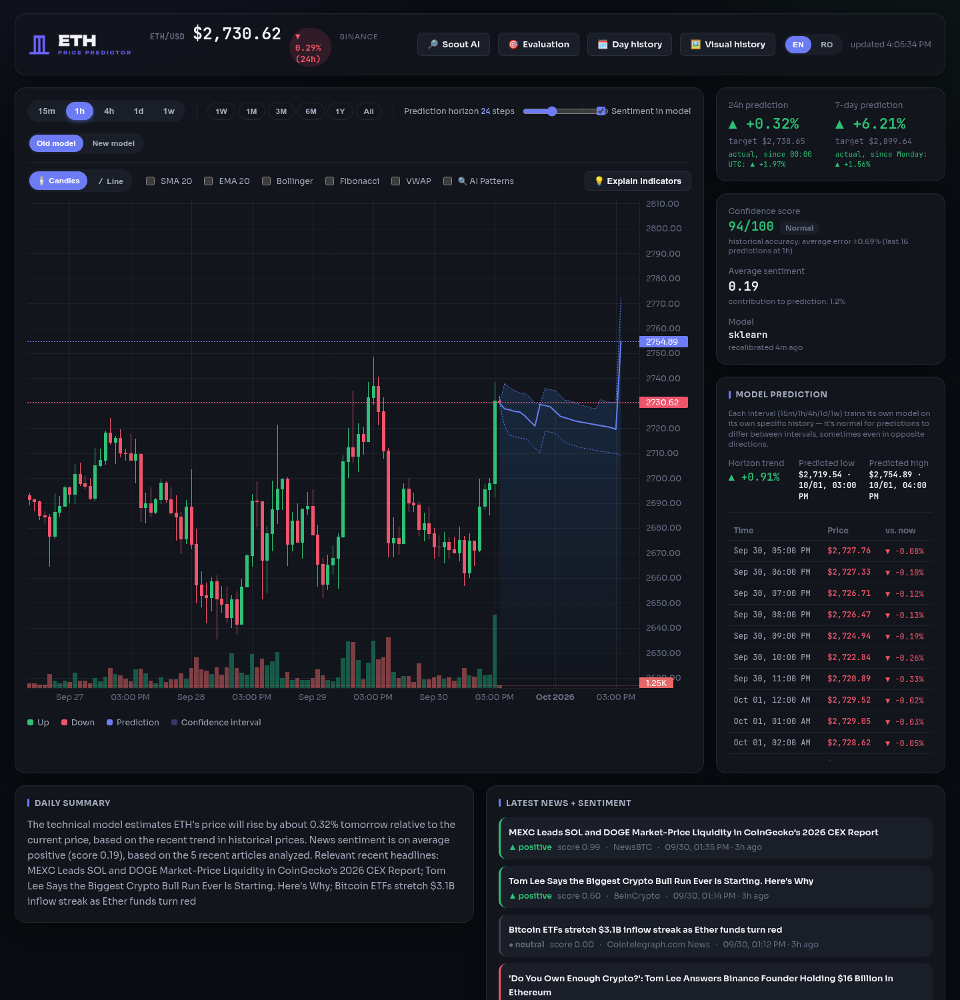

## Contents

- [How it works](#how-it-works)
- [Where the data is saved](#where-the-data-is-saved)
- [Structure](#structure)
- [Installation](#installation)
- [Running](#running)
- [Frontend](#frontend)
- [ETH Dashboard](#eth-dashboard)
  - [Box Breakout strategy](#box-breakout-strategy)
- [Scout AI](#scout-ai)
- [API](#api)
- [Prediction evaluation](#prediction-evaluation)
  - [Visual history](#visual-history)
- [Prediction models](#prediction-models)
  - [Evolving population](#evolving-population)
  - [Walk-forward backtest](#walk-forward-backtest)
- [Strategy fund](#strategy-fund)
  - [Strategy lab](#strategy-lab)
  - [Evolving strategies](#evolving-strategies)
- [Performance](#performance)
- [Tests](#tests)
- [Extending to other cryptocurrencies](#extending-to-other-cryptocurrencies)
- [Adding visuals and analysis charts](#adding-visuals-and-analysis-charts)

## How it works

One forecast, from raw data to the number on the dashboard:

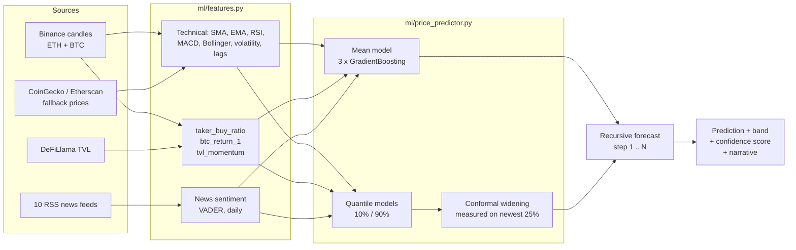

1. **Data.** Candles come from Binance (CoinGecko/Etherscan if Binance is
   down), news from 10 RSS feeds, DeFi TVL from DeFiLlama, BTC candles for
   the market-wide move.
2. **Features.** Each candle becomes a row of indicators (`ml/features.py`):
   technical indicators, the share of aggressive buying (taker buy ratio),
   BTC's return on the same candle, TVL momentum, and the day's news
   sentiment.
3. **Target.** The model learns a **log return**, not a price. That keeps it
   scale-free, so the same model works at $2,000 and $4,000.
4. **Models.** `tuned` is a **population of 24 small models that evolves**:
   each one lives only while it beats "the price stays the same" on real
   candles, the dead are replaced by children of the strongest, and each has
   a mood that scales how bold its forecast is (see
   [Evolving population](#evolving-population)). `legacy` is
   `GradientBoostingRegressor`s (different seeds, averaged) plus quantile
   models for the band.
5. **Forecast.** `tuned` predicts 1, 2, 4, 8, 12 and 24 candles ahead from
   the last *real* candle; the chart line is the vote of the strongest
   adults. `legacy` forecasts recursively: the predicted candle is appended
   to the history, indicators are recomputed, and the model predicts the
   next step, N times.
6. **Band.** For `tuned`, the band comes from the population's own past
   errors per horizon, so it really holds the price ~50% of the time (a 50%
   band, narrow on the chart) and widens with the horizon.
7. **Output.** Price path + band, a confidence score (`ml/combined_predictor.py`),
   a Buy/Sell/Wait signal, and a narrative text in English or Romanian.

Each interval (15m, 1h, 4h, 1d, 1w) trains its own model on its own history.
Two variants run side by side: `tuned` (regularized, calibrated band) and
`legacy` (sklearn defaults, the original behavior, kept unchanged as the
reference).

## Where the data is saved

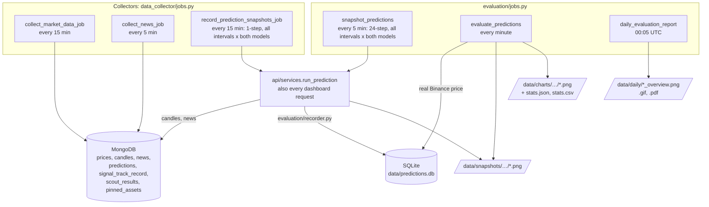

| What | Where | Written by | When |
|---|---|---|---|
| Live price, candles (all 5 intervals) | MongoDB `prices`, `candles` | `collect_market_data_job` | every `COLLECT_INTERVAL_MINUTES` (15) |
| News + sentiment | MongoDB `news` | `collect_news_job` | every `NEWS_INTERVAL_MINUTES` (5) |
| Dashboard accuracy history | MongoDB `predictions`, `signal_track_record` | `record_prediction_snapshots_job`, `backfill_signal_history` | every 15 min |
| Scout AI results, pins | MongoDB `scout_results`, `pinned_assets` | Scout scan, pin button | every `SCOUT_INTERVAL_MINUTES` / on click |
| **Every forecast, its real outcome and errors** | SQLite `data/predictions.db` | `evaluation/recorder.py` (hook in `run_prediction`) + `evaluation/evaluator.py` | on every prediction; scored every minute |
| Visual snapshot per forecast | `data/snapshots/{model}/{interval}/{day}/` | `evaluation/charts.py` | when logged, redrawn as real candles close |
| Final chart per completed forecast | `data/charts/{model}/{interval}/{day}/` | `evaluation/charts.py` | once, when it completes |
| Statistics | `stats.json` in every chart folder + `data/charts/stats.csv` | `evaluation/stats.py` | every minute (only rewritten if changed) |
| Daily overview | `data/daily/YYYY-MM-DD_overview.png` (+ `.gif`, `.pdf`) | `evaluation/daily_report.py` | 00:05 UTC |

**Everything is saved by default**: every interval (`15m, 1h, 4h, 1d, 1w`),
both model variants, both horizons (1 step and 24 steps). Nothing needs to
be enabled. What is *not* saved, on purpose: an exact repeat of the forecast
logged just before it (the model hasn't retrained in between). Otherwise the
dashboard, which asks every 30 seconds, would store hundreds of identical
copies a day.

`data/` is in `.gitignore`: it's your local history, not part of the repo.
Back it up by copying the folder (the SQLite file is self-contained).

## Structure

```
config.py                     # centralized configuration (.env)
run_api.py                    # Flask API entrypoint + prediction cache warm-up thread
run_scheduler.py               # periodic job entrypoint (APScheduler)

database/
  mongo_client.py             # Mongo connection (tz_aware), graceful fallback if Mongo is down
  repository.py                # CRUD: prices, candles, news, predictions, scout_results, pinned_assets

data_collector/
  http_utils.py                # GET with retry/backoff (rate limits, 5xx, timeouts)
  market_data.py               # current price + candlestick OHLC (Binance -> CoinGecko -> Etherscan)
  etherscan_client.py          # ETH/USD price + on-chain gas price (optional, needs an API key)
  defillama_client.py          # historical Ethereum DeFi TVL (public, no key, 6h cache)
  news_collector.py            # 10 crypto RSS sources, 5min cache on the raw fetch
  jobs.py                      # the actual work each scheduled job performs

nlp/
  sentiment.py                  # VADER score per article + daily aggregation

ml/
  features.py                   # feature engineering: technical + sentiment + taker_buy_ratio +
                                 # btc_return_1 + tvl_momentum
  price_predictor.py            # PricePredictor: sklearn ensemble (default) / prophet / lstm,
                                 # tuned/legacy variants, calibrated confidence band
  evolution.py                  # "tuned": evolving population with energy and emotions
  pretrain_evolution.py         # let the population live through years of old Binance candles
  evolution_report.py           # population page data: graveyard, generations, family trees
  market_context.py             # Fear & Greed, news, DeFi TVL, Binance funding/premium per candle
  direct_forecast.py            # previous "tuned" (one model per horizon), no longer used
  walk_forward.py               # walk-forward backtest on real Binance candles
  combined_predictor.py         # confidence score + narrative summary
  box_breakout.py               # Dynamic Box Breakout Strategy: boxes, breakout trades, backtest
  strategy_lab.py               # which way of trading makes the most money after fees (TRAIN/TEST)
  strategy_evolution.py         # evolving population of strategies (vol-target + Box + range genes)
  strategy_fund.py              # the live strategy fund on 4h/1d: report saved to data/strategy_fund/

scout/
  universe.py                   # what gets scanned: underdogs + a separate mega-cap tier
  revolut_allowlist.py          # only assets tradeable on Revolut (hand-editable list)
  pipeline.py                   # per-asset analysis: candles + news + model -> prediction + narrative
  scanner.py                    # orchestrates a full scan, saves ranked results
  narrative.py                  # per-asset "why and when" text

evaluation/                     # prediction evaluation (see "Prediction evaluation" below)
  schema.sql                    # SQLite schema of the `predictions` table
  storage.py                    # SQLite access: log, query/filter/sort/paginate, per-model summary
  recorder.py                   # the single hook called from api/services.run_prediction
  evaluator.py                  # fills real prices (Binance -> CoinGecko), errors, completion
  charts.py                     # per-prediction images: live snapshot + final chart (matplotlib, Agg)
  daily_report.py               # end-of-day overview PNG (+ GIF, PDF), missed-day recovery
  stats.py                      # stats.json / stats.csv at every folder level
  jobs.py                       # APScheduler wiring (every minute + 00:05 UTC)
  api.py                        # /api/evaluation/* blueprint (table, CSV, charts, stats, days)

api/
  routes.py                     # every endpoint (see the table below)
  services.py                   # orchestrates candles + sentiment + BTC + TVL + model -> prediction

frontend/
  web/                          # React + TypeScript SPA (Vite, Tailwind CSS v4) - see "Frontend"
    src/pages/                  # Landing, Dashboard, Scout, AssetDetail, Population, Fund, eval/{Evaluation,History,Visual}
    src/components/             # Shell (nav), PriceChart (lightweight-charts), shared UI primitives
    src/lib/                    # typed API client, formatting, indicators + Buy/Sell heuristic, chart theme
    src/i18n/                   # EN/RO dictionary + runtime
  dist/                         # production build (git-ignored), served by Flask

docs/
  images/                        # screenshots and charts used in this README
  scripts/band_charts.py         # regenerates docs/images/band-*.png from a real backtest
  scripts/strategy_charts.py     # regenerates docs/images/strategy-*.png (after ml.strategy_fund)

tests/                          # pytest, fully offline (mongomock + requests-mock)
```

The code is organized so that adding another cryptocurrency to the main
dashboard just means changing the `coin_id` / `symbol` parameters — nothing
in the pipeline is hardcoded to Ethereum outside the defaults in
`config.py`. Scout AI already scans dozens of different assets out of the box.

## Installation

```bash
python3 -m venv .venv
source .venv/bin/activate
pip install -r requirements.txt
cp .env.example .env   # fill in whichever API keys you have (all optional)
```

The app works out of the box **with no API key at all**: prices come from
Binance/CoinGecko (public), TVL from DeFiLlama (public), and news from 10 RSS
feeds. The optional keys (`CRYPTOPANIC_API_KEY`, `NEWSAPI_KEY`,
`ETHERSCAN_API_KEY`) improve coverage but aren't required — a missing
`ETHERSCAN_API_KEY` just disables the gas price badge.

MongoDB is optional for quickly testing the API: if it isn't available,
`database/mongo_client.py` keeps running without persistence (logs a
warning) instead of crashing the app. For real use you need a Mongo
instance:

```bash
docker run -d --name eth-mongo -p 27017:27017 mongo:7
```

## Running

A single process. Flask serves the API, the built frontend
(`frontend/dist/`, see [Frontend](#frontend)), and periodic data collection (candles + news + Scout AI
scanning), all on the same port:

```bash
# once, and after any frontend change:
(cd frontend/web && npm install && npm run build)

# Flask API + dashboard + Scout AI + data collector, at http://localhost:5000
.venv/bin/python run_api.py
```

On startup it immediately seeds current data, then refreshes it
automatically on an interval (candles/price every `COLLECT_INTERVAL_MINUTES`,
news every `NEWS_INTERVAL_MINUTES`, Scout AI scans every
`SCOUT_INTERVAL_MINUTES`) for as long as the process runs — there's no
second process to start separately, and no risk of forgetting to start it
and being left with stale (unrefreshed) candles with no visible error.

If you're running multiple API instances (e.g. several workers) and want
ONE central collector instead of each instance collecting independently,
you can start collection as its own process with
`.venv/bin/python run_scheduler.py` — see that file's docstring for details.

The ETH prediction needs at least ~40 stored historical candles for the
requested interval (default 1h) — let the app run for a bit after startup,
or run a single manual collection:

```bash
python -c "from data_collector.jobs import run_all_once; run_all_once()"
```

Scout AI automatically kicks off a first scan (on a background thread, so it
doesn't block the scheduler from starting) — it takes a few minutes, since it
trains a real model per asset across ~135 assets (the original `legacy` model;
the evolving `tuned` population is only used for the dashboard's coin).

## Frontend

A React 19 + TypeScript single-page app in `frontend/web/` (Vite, Tailwind CSS
v4, TanStack Query for polling, React Router, lightweight-charts 4). Flask
serves its production build from `frontend/dist/` and falls back to
`index.html` for every client-side route; the old `*.html` URLs
(`/dashboard.html`, `/detail.html?type=&id=`, ...) redirect to the new ones.

```bash
cd frontend/web
npm install
npm run dev     # http://localhost:5174, proxies /api to ALFA_API (default http://127.0.0.1:5050)
npm run build   # type-check + build into ../dist, then just run `python run_api.py`
```

During development run the API with `FLASK_PORT=5050 python run_api.py`
(on macOS port 5000 is taken by AirPlay Receiver).

Routes: `/` landing · `/dashboard` · `/scout` · `/asset/:type/:id` ·
`/evaluation` · `/history` · `/visual` · `/population` · `/fund`.

Design tokens (colors, fonts, radii) live in `src/styles/index.css`; chart
colors are read from the same CSS variables at runtime (`src/lib/theme.ts`).
The Buy/Sell/Wait heuristic in `src/lib/indicators.ts` must stay in sync with
`ml/trading_signal.py`, which backtests the same rule.

## ETH Dashboard

`http://localhost:5000/dashboard` (the landing page at `/` links to it) — a candlestick chart (Lightweight Charts) with:
- an overlaid prediction + confidence band, SMA/EMA/Bollinger/Fibonacci indicators,
- a price tooltip that tracks the mouse (read directly off the price scale
  at the cursor's Y position, so it always matches the axis exactly — also
  works over the prediction region, where there's no real candle),
- a live price ticker (polled every 3s) + 24h change,
- a "Pinned" panel — assets bookmarked from Scout AI show up right next to the ETH price,
- a Buy/Sell signal panel from RSI + MACD + trend + sentiment,
- separate predictions for the 24h and 7-day horizons.

### Box Breakout strategy

The **📦 Box Breakout** toggle on the chart runs the Dynamic Box Breakout
Strategy (`ml/box_breakout.py`) on the stored candles of the chosen
interval, draws it, and explains it in a panel:

- **Boxes** (Darvas-style): at each bar, the highest high and lowest low of
  the last *X* bars that ended *Y* bars ago. If the
  *Y* bars since then stayed inside, the range has held and a box is drawn,
  extended forward until a candle *closes* outside it. Green/red: it broke
  up/down; grey: it broke without volume (no trade); blue: still active.
- **Entries** on the close of the breakout candle: long above the ceiling,
  short below the floor, only if that candle's volume is above its
  14-bar average, the fakeout filter. One position at a time; a
  confirmed breakout the other way reverses it.
- **Risk**: stop at the opposite side of the box; take profit at a
  risk:reward multiple, or instead trail the stop to the floor
  (ceiling for shorts) of each new box.
- **Backtest** rules: 0.1% fee per side, the still-open last candle is
  never used, stops are checked before targets when one candle touches
  both, and a stop the price gaps through fills at the open.

**Self-tuning.** Nothing is set by hand. Every 100 candles the algorithm
re-runs the strategy with 48 setting combinations (box length 10/20/30/50,
hold 3/5/8, exit at 1:1.5 / 1:2 / 1:3 or trailing) on the **previous 500
candles only**, and keeps the one that would have made the most after fees
(at least 3 trades). It trades the next 100 candles with it. If no
combination made money, it stands aside until the next check (boxes are
still drawn, no trades). The panel shows the settings in use, why they were
picked, and when the next check is.

**Honest stats.** Every number in the panel comes only from candles the
algorithm hadn't seen when it chose its settings (walk-forward, out of
sample); the first 500 candles are only used for learning. Next to the
trade stats, the panel shows how the boxes themselves behaved: count, height,
duration, up/down breakouts, how many had volume, and how many **followed
through** (moved one box height further before closing back inside).

On ETH (October 2026, stored candles), out of sample: the strategy lost
money on 15m, 1h, 4h and 1w, and only 8-16% of intraday breakouts followed
through. Most breakouts on ETH return to the box. That is a real finding
about the market, not a bug: the algorithm can stand aside when breakouts
stop paying, but it can't create an edge that isn't there.

`GET /api/box-breakout?interval=` returns all of it (cached until the next
candle). `ml/box_breakout.py`'s `run()` still runs one fixed set of
settings, for tests and experiments.

## Scout AI

`http://localhost:5000/scout` — scans:
- **Underdogs**: crypto ranked 30-250 on CoinGecko + "trending" coins, stocks
  from the Yahoo Finance screeners `small_cap_gainers` / `aggressive_small_caps` /
  `undervalued_growth_stocks`. They show up if the prediction is positive and
  the model's confidence is ≥ 25/100.
- **Mega-cap (escape hatch)**: the top 30 crypto by market cap + large stocks
  (≥ $50B) from the `day_gainers` screener. These assets do NOT appear
  automatically — they need a prediction of **at least +10% over 7 days**
  with confidence ≥ 40/100 to pass the filter, flagged with a **⭐ Mega-cap**
  badge. The goal: if a big name genuinely has a dramatic signal, it still
  shows up, without diluting the rest with noise from a mega-cap's ordinary moves.
- Both universes are filtered to **only assets tradeable on Revolut**
  (`scout/revolut_allowlist.py` — a hand-editable list).
- **Pin**: any asset can be bookmarked (☆ → ★), saved in MongoDB — it stays
  accessible even if it drops out of the current scan, and shows up both in
  Scout AI's "Pinned" tab and next to the ETH price on the main dashboard.
- Clicking a row → a per-asset detail page, with a chart, a 7-day
  prediction, a "why and when" narrative, analyzed news, and a live price.

## API

| Endpoint | Description |
|---|---|
| `GET /api/health` | Health check |
| `GET /api/price/current` | Current ETH price, 24h volume, 24h change |
| `GET /api/price/history?interval=15m\|1h\|4h\|1d\|1w&limit=` | OHLC history |
| `GET /api/predict?interval=&steps=&use_sentiment=` | Price prediction + confidence interval + score |
| `GET /api/outlook?use_sentiment=` | Quick 24h + 7-day prediction |
| `GET /api/news?limit=` | Latest articles + sentiment |
| `GET /api/sentiment?days=` | Aggregated daily sentiment score |
| `GET /api/summary?interval=&lang=en\|ro` | Prediction + narrative summary + supporting news |
| `GET /api/gas` | On-chain gas price (needs `ETHERSCAN_API_KEY`) |
| `GET /api/patterns?interval=&lang=en\|ro` | Rule-based candlestick + geometric chart pattern detection |
| `GET /api/strategy/fund?interval=4h\|1d` | The evolving strategy fund: position now and its three pieces, money vs buy & hold since 2020 and on unseen years, year by year, genes (see [Strategy fund](#strategy-fund)) |
| `GET /api/box-breakout?interval=` | Self-tuning Box Breakout strategy: boxes, trades, settings history, out-of-sample stats (see [Box Breakout strategy](#box-breakout-strategy)) |
| `GET /api/scout?asset_type=crypto\|stock&limit=` | Latest Scout AI scan results, ranked |
| `GET /api/scout/detail?asset_type=&id=&lang=en\|ro` | Full per-asset detail (chart, prediction, narrative, news) |
| `GET /api/scout/price?asset_type=&id=` | Lightweight live price for the detail page |
| `GET /api/scout/pins?asset_type=` | List of pinned assets |
| `POST /api/scout/pins` | Pin an asset (`{asset_type, id, symbol, name}`) |
| `DELETE /api/scout/pins?asset_type=&id=` | Unpin an asset |

`lang` (where supported) picks the language of any human-readable
narrative/note text in the response - `"en"` (default) or `"ro"`; it's pure
output-language selection over already-computed numbers and never triggers
a re-prediction.

## Prediction evaluation

Every prediction any model makes (`api.services.run_prediction`: dashboard
chart, outlook tiles, summary, the recurring snapshot job) is logged to a
SQLite database, scored against the real Binance price once its target candle
has closed, and drawn as a PNG. The models themselves are untouched; one call
at the end of `run_prediction` (`evaluation/recorder.py`) records their output
and never raises.

**How it runs.** Nothing extra to start: `python run_api.py` (or
`run_scheduler.py`) registers the jobs on the existing APScheduler:

| Job | When | What |
|---|---|---|
| `snapshot_predictions` | every 5 min | 24-step forecast for every interval in `EVAL_SNAPSHOT_INTERVALS` (all five by default), both model variants (warm cache, cheap); logged only if it differs from the last one |
| `record_prediction_snapshots` | every 15 min | 1-step forecast for all five intervals, both variants (at most one per candle) |
| `evaluate_predictions` | every minute | append every real candle that has closed and redraw that prediction's snapshot; when the last one has closed, compute `abs_error`, `pct_error`, `direction_correct`, set `completed`, draw the final PNG |
| `daily_evaluation_report` | 00:05 UTC | `data/daily/YYYY-MM-DD_overview.png` (+ `.gif`, `.pdf`) for the day that just ended |
| startup recovery | on start | move PNGs from the old flat layout, finish whatever resolved while the app was down, draw missing charts, write stats, build the overviews for any past days that don't have one |

Life of one prediction:

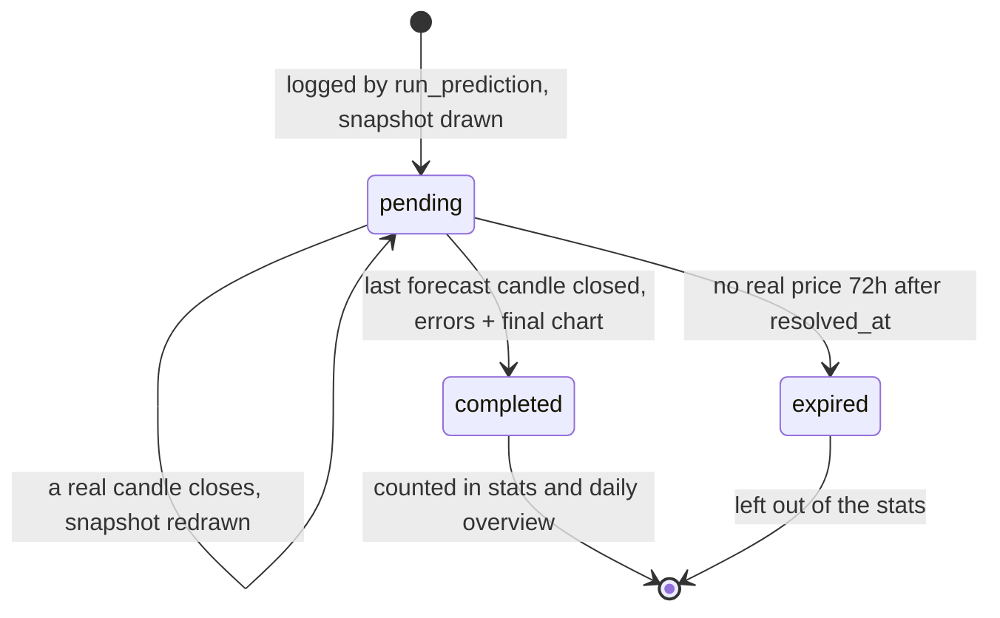

**Storage.** `data/predictions.db`, table `predictions`
([evaluation/schema.sql](evaluation/schema.sql)). The unique key is
`(interval, model_name, created_at)`. On top of that, at most one row is kept
per `(interval, model_name, horizon_steps)` per candle of that interval. The
dashboard polls `/api/predict` every 30s while the model only retrains every
~15min, so without this one real forecast would be logged hundreds of times.
`model_name` is `<backend>-<variant>` (`sklearn-tuned`, `sklearn-legacy`). All
times are UTC (`YYYY-MM-DDTHH:MM:SSZ`). The browser converts them to the
viewer's timezone. The date filters are UTC dates.

**Scoring.** A forecast point at timestamp `T` means the close of the candle
that opens at `T` (the same convention the models train on), so the real
price for `T` is known at `T + interval`. `target_time` is the last forecast
candle and `resolved_at = target_time + interval`.
- `pct_error = (predicted - actual) / actual * 100`, signed: positive means
  the model was too high.
- `direction_correct` is true when the model called the same side of
  `price_at_prediction` (up / down / flat) as reality.
- If Binance fails after retries, or has a hole for a closed candle, CoinGecko
  price history fills the gap (last price at or before the candle close).
- A prediction whose final price is still missing `EVAL_EXPIRE_HOURS` (72h)
  after `resolved_at` is marked `expired` and left out of the statistics.

**Visual history.** Every logged prediction gets an image drawn like the
dashboard chart. It shows the last 48 real candles the model saw, then the AI
forecast (dashed line + confidence band), with the real candles drawn *on top
of* the forecast as they close. The image is saved to
`data/snapshots/{model}/{interval}/YYYY-MM-DD/…png` (the day it was made) the moment the
prediction is logged, and redrawn every minute that new real candles arrive.
24-step forecasts (`EVAL_SNAPSHOT_STEPS`) get a new row + image every time the
forecast actually changes (the model retrained into a different answer). A
repeat of the same forecast is skipped. Other horizons keep one per candle.
`/visual` shows them as a gallery, newest first (see [Visual history](#visual-history)).

| While it's running | Once it's completed |
|---|---|
| 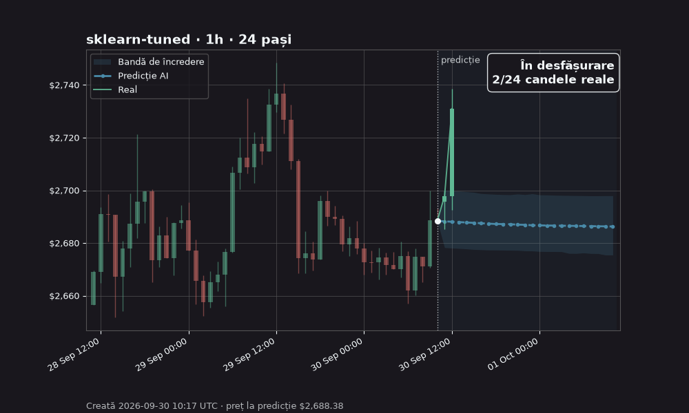 | 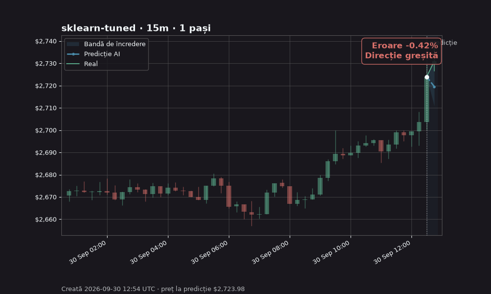 |
| Real candles (green/red) are drawn over the AI forecast (blue dashed line + band) as they close. | The corner shows the final error and whether the direction was right. |

**Charts.** `data/charts/{model}/{interval}/YYYY-MM-DD/{interval}_{model}_{created_at}.png`.
The date is the day the prediction resolved, so the 00:05 report always finds
every chart of the day that just ended. Charts are idempotent: an existing
file is never redrawn.

**Folder layout and stats.** Charts and snapshots are browsable two ways:

```
data/charts/
  stats.json, stats.csv                  overall; per model, interval, day and combinations
  sklearn-tuned/
    stats.json                           this model: per interval, per day
    1h/
      stats.json                         this model + interval: per day
      2026-09-30/1h_sklearn-tuned_….png
  by-date/2026-09-30/
    stats.json                           this day: per model, per model + interval
    *.png                                links to every model/interval's charts of the day
```

`data/snapshots/` has the same tree (without stats). The stats files refresh
every minute with the evaluation job; `GET /api/evaluation/stats` returns the
same numbers. PNGs from the old flat `YYYY-MM-DD/` layout are moved on startup.

**Dashboard.** `/evaluation` has the per-model summary and the table,
with filters (interval, model, status, dates), sorting by clicking a column,
pagination, CSV export, and a click on a completed row to open its chart.
`/history` shows the daily overviews with a date selector.
`/visual` is the visual history gallery (below).

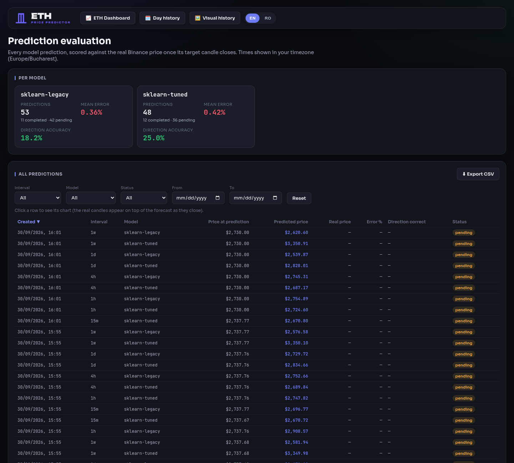

### Visual history

`http://localhost:5000/visual` is organized the same way as the folders
on disk, with statistics at every level:

- **General statistics** on top: predictions (completed / pending / expired),
  mean error in % and in $, direction accuracy, and bias (a positive bias
  means the model tends to predict too high).
- **By model**: pick the model, then the interval (each button shows how many
  forecasts it has). The selection's stats appear underneath. With "All"
  intervals, you get a table per interval; with one interval, a table per
  day. The gallery is grouped by day, newest first.
- **By day**: pick a day. You get that day's stats, a table per
  model + interval, and the gallery grouped by model + interval.
- Click a table row to jump there (a day opens the day view, a
  model + interval opens its gallery). Click an image to open it full size.
- The selection is kept in the URL (`#view=model&model=sklearn-tuned&interval=1h`),
  so any view can be bookmarked or shared.
- **Horizon**: 24-step forecasts only (default) or every horizon.

| By model → interval | By day |
|---|---|
| 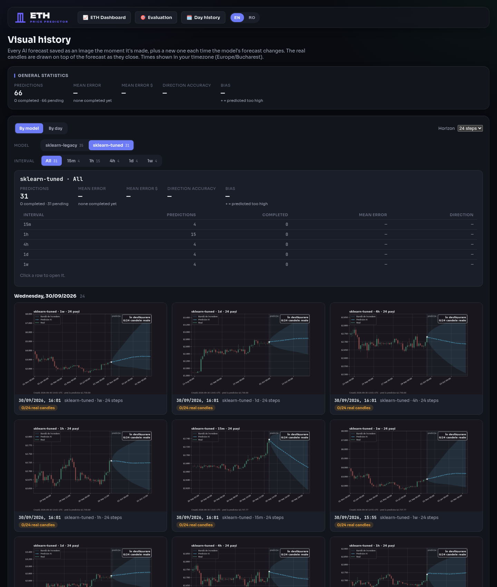 | 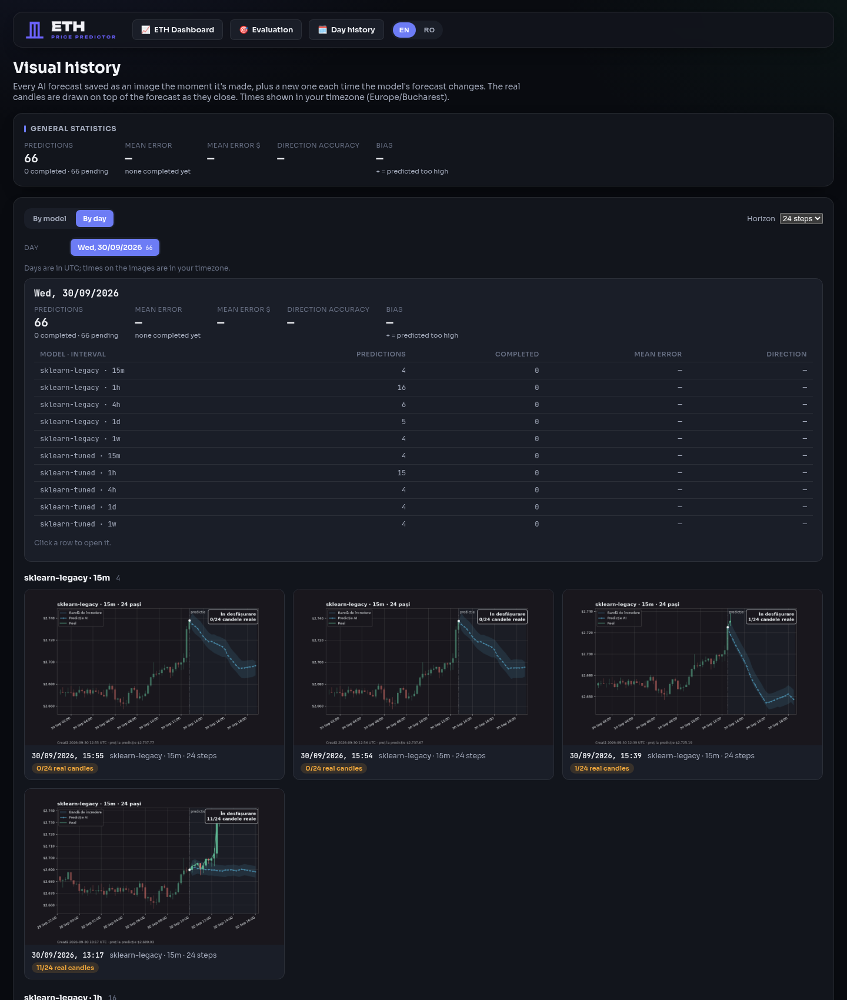 |

**API** (`/api/evaluation`):

| Endpoint | Description |
|---|---|
| `GET /predictions?interval=&model=&status=&horizon_steps=&date_from=&date_to=&sort=&order=&page=&page_size=` | Table rows + per-model summary (count, mean \|error %\|, direction accuracy %) |
| `GET /predictions.csv?…same filters…` | Every matching row as CSV |
| `GET /predictions/<id>/chart.png` | Final chart of one completed prediction |
| `GET /predictions/<id>/snapshot.png` | Visual snapshot, current state (any status) |
| `GET /models` | Model names and intervals, for the filters |
| `GET /stats?…same filters…` | Accuracy stats for the matching predictions: overall, per model / interval / day (resolved) and their combinations, plus `by_created_day` |
| `GET /prediction-days?…same filters…` | Days (UTC) predictions were made on, newest first, with counts |
| `GET /stats/steps?…same filters…` | Per forecast step: model vs "no change" mean error, skill score, band coverage |
| `GET /predictions/<id>/diagnostics` | The evolving population's log for one `tuned` prediction (see [Evolving population](#evolving-population)) |
| `GET /days` | Days that have an overview, newest first |
| `GET /days/<YYYY-MM-DD>` | That day's stats + which files exist |
| `GET /days/<YYYY-MM-DD>/overview.png\|gif\|pdf` | The daily overview files |

**Settings** (`.env`): `EVAL_DATA_DIR` (default `data`), `EVAL_DB_FILE`
(`predictions.db`), `EVAL_EXPIRE_HOURS` (72), `EVAL_DAILY_GIF` / `EVAL_DAILY_PDF`
(both on), `EVAL_SNAPSHOT_STEPS` (24), `EVAL_SNAPSHOT_INTERVALS` (`15m,1h,4h,1d,1w`, comma
separated), `EVAL_SNAPSHOT_EVERY_MINUTES` (5), `EVAL_SNAPSHOT_HISTORY_CANDLES` (48).

**By hand:**

```bash
.venv/bin/python -c "from evaluation.evaluator import complete_pending_predictions as f; print(f())"
.venv/bin/python -c "from evaluation.charts import generate_missing_charts as f; print(f())"
.venv/bin/python -c "from datetime import date; from evaluation.daily_report import build_daily_report as f; print(f(date(2026, 9, 29), force=True))"
```

## Prediction models

`PREDICTION_BACKEND` in `.env` picks the backend:
- `sklearn` (default) — an ensemble of `GradientBoostingRegressor` (3
  different seeds, averaged) on log returns, with a real confidence interval
  via quantile regression.
- `prophet` — needs `pip install prophet`.
- `lstm` — an extension point (needs `pip install tensorflow`).

Features used for training (`ml/features.py`):
- technical: SMA/EMA, RSI(14), volatility, MACD, Bollinger position, relative
  volume, 6 price lags,
- **taker buy ratio** — what percentage of each candle's volume was
  aggressive buying (straight from Binance's own breakdown) — a real proxy
  for demand vs. supply,
- **btc_return_1** — BTC's own return on the same time grid — most altcoins
  (ETH included) move more in lockstep with BTC than on their own
  fundamentals,
- **tvl_momentum** — the daily change in Ethereum DeFi TVL (DeFiLlama) — a
  real "network utility" signal, not just price and volume,
- news sentiment, aggregated daily.

Any feature that can't be computed for a given asset (e.g. taker-buy doesn't
exist for stocks, TVL only applies to ETH) falls back to a neutral value
instead of dropping the row from training.

**Model variants** (`model_variant=tuned|legacy`, the dashboard's
"New model / Old model" toggle; both are always evaluated):

| | `tuned` (default) | `legacy` |
|---|---|---|
| Models | evolving population of 24 ridge regressions with energy and moods | GradientBoostingRegressor, sklearn defaults (100 trees, depth 3, 0.1) |
| Forecast | 6 horizons from the last real candle, vote of the 8 strongest | recursive: each predicted candle is fed back in |
| Confidence band | from the population's own past errors: 50% band, really holds the price ~50% of the time, widens with the horizon | raw quantile band, one step wide at every step |
| Changes | improved over time | frozen: identical output to the original model on GitHub, as the reference |

### Evolving population

`tuned` (`ml/evolution.py`) is not one model but a population of 24 small
ones that compete to stay alive on the real price history.

- **Money is life.** Every model predicts the log return 1, 2, 4, 8, 12
  and 24 candles ahead and **trades 100 € (virtual) with it**: long, short
  or out of the market, up to all of its money (no leverage). It pays
  Binance's 0.1% fee on every trade and a **daily tax of 0.05 €** (~18 € a
  year; ETH rose ~26% a year on average), charged per candle by its length
  so it's the same on every interval, and **3× that on days its money sits
  out of the market**: it is pushed to trade and must earn at least its tax
  to survive. Its energy *is* its money: below 10 € it dies. (`DAILY_TAX`,
  `IDLE_TAX_MULT` in `ml/evolution.py`.)
  - *Size*: half the Kelly fraction (expected move per candle / its
    variance). Kelly is the bet that grows money fastest in the long run;
    half of it because the edge is only an estimate (full Kelly on an
    overestimated edge took the 15m and 1h funds to zero).
  - *When*: it enters or flips only when the move expected over its
    24-candle forecast beats its **patience** gene in round trips of
    fees; it keeps a position while the forecast still points the same
    way (holding costs nothing) and leaves when it turns.
  - *The goal is the most money, not just surviving*: the richest have
    the most children and the most weight in the vote, and every 24
    candles the adult growing its money the slowest is replaced by a child
    of the rich ("outcompeted"). Causes of death: outcompeted, one big loss
    (25%+ in one candle), fees, bad trades, taxes.
  - The **fund** is the population's vote trading 100 € the same way, next
    to buying ETH with 100 € and holding it. Returns are ETH/USDT's; the
    EUR/USD rate is ignored.
  - Combos (right on every horizon at once) and prediction accuracy are
    still tracked and shown, but only money keeps a model alive.
- **Birth.** Each dead model is replaced by a child of two rich ones
  (tournament selection on money): their genes mixed, then mutated. Nobody
  tunes anything by hand; the population learns by selection.
- **Genes.** Which inputs it looks at (momentum, trend, long context,
  volatility, volume, RSI/Bollinger, BTC, and the market context below),
  how much history it learns from, how strongly it's regularized, how bold
  it is, its temperament and its news sensitivity.
- **Market context** (`ml/market_context.py`), each aligned so a candle
  only sees what was known when it opened: the Crypto Fear & Greed Index
  (daily since 2018, previous day's value), the app's own news sentiment
  (previous day, only where there was news), Ethereum DeFi TVL change
  (DeFiLlama), Binance perpetual funding rate (since late 2019) and premium
  (perp vs spot). A gene can only be born once its data exists. `legacy`
  gets Fear & Greed, funding and premium as extra features too (missing
  values = 0), on top of the TVL and sentiment it already had.
- **Emotions.** Each model has a mood: its recent win rate against "no
  change", remembered for about 1/temperament candles. Its forecast is
  scaled by mood × boldness, so after a run of mistakes a model is afraid
  and barely moves its forecast, and after a run of wins it commits.
  Moods are shown as fear / caution / calm / confidence / euphoria. **The
  news moves moods too:** the market's sentiment (yesterday's news, or the
  Fear & Greed Index on days without news) shifts a model's mood by up to
  ±0.5 × its news-sensitivity gene, which can be negative (a contrarian).
  Selection decides which kind lives longer; the card shows the average
  lifespan per gene.
- **Forecast.** The energy-weighted vote of the 8 strongest adults.
- **Band.** Drawn like `legacy`'s: at every step it's as wide as the vote's
  typical error on the *next* candle (the 25%-75% range of its own real
  errors), so it stays narrow and almost constant on the chart. It
  describes one candle's uncertainty, not the accumulated one, so far out
  the real price falls outside it more often than half the time. Set
  `BAND_MODE = "cumulative"` in `ml/evolution.py` for a band that widens
  with the horizon and holds the price ~50% of the time at every step, and
  `BAND_QUANTILES = (0.10, 0.90)` for 80% instead of 50%. Past 24 steps it widens as *k*^0.57 (measured on
  real ETH candles; a pure random walk would be 0.5).

It is a deterministic replay (fixed seed) of the history it is given, one
candle at a time, using only what was known at each candle: inputs at *t*
come from candles up to *t*, a model trained at *t* only sees targets that
had resolved by *t*, and it is judged only on outcomes after it predicted
them. Replaying 1000 candles takes ~0.5 s (the models are ridge
regressions). With very little history the population isn't born yet and
the forecast is honestly "no change".

**It keeps living.** In the app, each coin/interval has one population
(`data/evolution/<coin>_<interval>.joblib`) that continues with every
candle that closes, instead of starting over: it survives refreshes and
app restarts. The still-open last candle is never lived (its close would
still change). If the app was off for longer than the stored candles
cover, a new population starts on what's available.

**Train it on old charts** (once, ~5-10 minutes for all intervals):

```bash
.venv/bin/python -m ml.pretrain_evolution                         # ETH: 15m 1h 4h 1d 1w
.venv/bin/python -m ml.pretrain_evolution --interval 1h --candles 50000
```

It downloads years of closed candles from Binance (ETH since 2017 for the
slower intervals) and lets the population live through all of it, then
saves it; the running app picks the new file up on its next refresh. It
prints the **real track record**: over every candle of that history, how
often the vote beat "no change" and called the direction, each time on
candles it hadn't seen yet. The same track record keeps growing live and
is shown in the dashboard card.

Track record from the pretraining on ETH (October 2026, August 2017 to the
last closed candle), every vote on a candle it hadn't seen yet. Each
history was lived twice on the same candles: with only the price-based
genes, and with the market context + news-swayed moods:

| Interval | Candles lived | Deaths | Direction right, 1 / 24 ahead: price only | with context + news |
|---|---|---|---|---|
| 15m | 319,398 | 13,295 | 50.6% / 49.6% | 50.2% / 49.6% |
| 1h | 79,844 | 3,313 | 50.6% / 50.4% | 50.4% / 50.1% |
| 4h | 19,959 | 818 | 50.4% / 49.2% | 50.2% / 49.8% |
| 1d | 3,309 | 128 | 50.5% / 47.4% | 50.4% / 42.7% |

And its money (100 € each, the fund = the population's vote, same history):

| Interval | Fund | Trades | Fees paid | Buy & hold |
|---|---|---|---|---|
| 1w | 158 € | 116 | 4 € | 250 € |
| 1d | 37 € | 986 | 17 € | 361 € |
| 4h | 1.61 € | 8,886 | 136 € | 909 € |
| 1h | 0.09 € | 13,841 | 227 € | 809 € |
| 15m | 0.03 € | 21,479 | 1,447 € | 936 € |

Trading on a forecast that is right half the time loses to fees, faster
the shorter the candle. That is what led to the [Strategy fund](#strategy-fund).

With tens of thousands of votes the uncertainty is a few tenths of a
percent, so this is a firm result: over nine years of ETH, nothing the
population can see (price, volume, volatility, RSI/Bollinger, BTC, Fear &
Greed, DeFi TVL, Binance funding and premium, news) predicts the next move
better than a coin flip, and the extra data didn't change that. Models
carrying the new genes lived about as long as the others (e.g. 1h: 470-596
candles vs 492 for price-only genes). The population learned to be
cautious instead of guessing, which is why its line stays close to the
current price.

Population size doesn't change it either: on the same 4h history, 12, 24,
48 and 96 models all landed at ~50% direction (two seeds each); the cost
grows with the size, the accuracy doesn't. 24 stays the default.

**The population page** (`/population`, "🧬 Model population" in the
top bar, or the link in the dashboard card) shows everything about one
interval's population: its whole life on a time line (ETH price, deaths
per period, mood), **why models died** (one fatal miss / repeated misses /
exhaustion), how long models with each gene lived, **what evolved** (the
share of the population using each input and the average of each numeric
gene over time, one small chart each), a table of generations, the
**graveyard** (every death: when, the market at that moment, the
prediction that hurt it most, its mood, record and genes; filterable by
cause, generation or model) and who's alive. Click any model for its full
story and family tree. API: `GET /api/evolution/report?interval=`,
`/api/evolution/deaths?interval=&cause=&generation=&organism=&page=`,
`/api/evolution/organism/<id>?interval=`.

The dashboard's **🧬 Model population** card (when "New model" is
selected) shows the population's mood, births, deaths, average lifespan,
who is voting with their energy, mood and inputs, which inputs the voters
use, and the mood over time. Every `tuned` forecast also stores this log
next to it in the evaluation database
(`GET /api/evaluation/predictions/<id>/diagnostics`); per-step accuracy
against "no change" is at `GET /api/evaluation/stats/steps`.

### Walk-forward backtest

`ml/walk_forward.py` checks the model the way it's used live. For each
forecast starting point, a fresh model is trained **only on the candles up
to that moment**, asked for an N-step forecast, and scored against the real
candles that followed. No future information reaches training.

```bash
.venv/bin/python -m ml.walk_forward --interval 1h --candles 3000 --windows 40 --horizon 24 --variant tuned
.venv/bin/python -m ml.walk_forward ... --features relative   # scale-free features instead of dollar ones
```

It prints the band coverage (step 1, whole path, last step), the error vs
a "price doesn't change" baseline (below 1 = better than the baseline),
direction accuracy with its standard error, and how spread out the
predictions are compared to reality. A run on ETH 1h, 40 windows, 24 steps
(separate from the charts above, on a slightly different candle window, so the
numbers differ a little):

| Features | Band coverage | Error vs "no change" | Direction at 24h |
|---|---|---|---|
| price-level (default) | 78.6% | 1.21 | 47.5% ± 7.9% |
| `--features relative` | 75.0% | 1.14 | 55.0% ± 7.9% |

The differences between the two feature sets (they apply to `legacy`) are
inside the noise of 40 windows, so the default stays unchanged.

`tuned` vs `legacy`, ETH, 40 windows, same candles (October 2026). The
"direct" row is the previous `tuned` (one model per horizon, shrunk toward
"no change"), replaced by the evolving population:

| Variant | Interval, steps | Band coverage (path / last) | Error vs "no change" at last step | Skill over path | Direction at last step | Spread vs reality |
|---|---|---|---|---|---|---|
| `tuned` (evolving) | 1h, 24 | 77.6% / 75.0% | 1.036 | -0.027 | 42.5% ± 7.8% | 0.09 |
| previous `tuned` (direct) | 1h, 24 | 85.8% / 92.5% | 1.015 | -0.002 | 35.7% ± 12.8% (14 of 40 called) | 0.03 |
| `legacy` (recursive) | 1h, 24 | 25.7% / 17.5% | 4.00 | -1.61 | 52.5% ± 7.9% | 3.38 |
| `tuned` (evolving) | 4h, 6 | 86.2% / 87.5% | 1.034 | -0.013 | 42.5% ± 7.8% | 0.07 |
| `legacy` (recursive) | 4h, 6 | 61.7% / 40.0% | 1.31 | -0.22 | 40.0% ± 7.7% | 0.63 |

`tuned`'s band holds the price; `legacy`'s doesn't. No variant beats "no
change" on the point forecast or calls the direction better than a coin
flip within the noise of 40 windows. The evolving population moves 3x
more than the direct model did and errs only ~3.5% more than a flat line;
`legacy` moves more than the real price and errs 4x more on 1h. A separate
test of extra inputs (longer context, Binance futures funding rate and
premium, pooling 10 coins) found the same: at best ~52-53% direction
accuracy, no gain on the price itself. With fewer than 30 windows the
script warns that small differences don't mean anything.

## Strategy fund

The evolving population above showed that where ETH goes next is not
predictable here. How much it will move is: the volatility of the last day
predicts the next day's with a correlation of 0.66, against -0.006 for the
direction. The strategy fund trades on that (`ml/strategy_lab.py`,
`ml/strategy_evolution.py`, `ml/strategy_fund.py`, page `/fund`,
"💼 Strategy fund" in the top bar, and a card on the dashboard).

Checks made first, nine years of ETH, every model trained only on the past:

| What | Result |
|---|---|
| `legacy` direction, 200 independent windows, 24 candles ahead | 1h 50.0% ± 3.5%, 15m 52.5% ± 3.5% |
| A logistic model's direction, 2,828 out-of-sample days | 52.2% ± 0.9% (always "up": 51.8%); its most confident fifth 52.7% |
| The pattern recognition signals, 9,091 calls on 1h | 48.6% right; single patterns disagree between 1h and 4h |
| Box Breakout, walk-forward (its own settings from the past) | 4h +1,588% vs buy & hold +813%, worst drop 74%; 1h -19% |

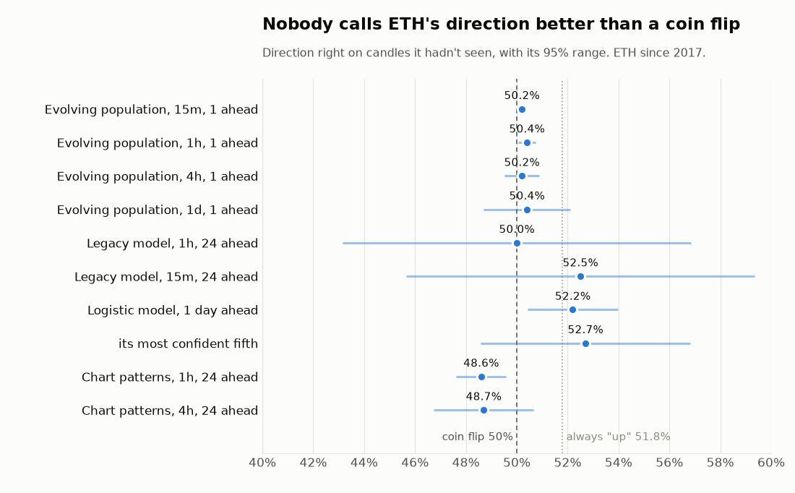

### Strategy lab

`ml/strategy_lab.py` trades 100 € (virtual) with Binance's 0.1% fee per
side. The volatility forecast is refit every year on the years before
only; each strategy's settings are picked on TRAIN (up to 2022, with at
most a 60% drop) and scored once on TEST (2023 on):

- `vol_target`: long ETH sized by the volatility forecast, rebalanced only
  when the target drifts more than a band.
- `range`: buy low inside the forecast range, sell at its middle (short
  the mirror on long/short), stand aside when too wild or trending.
- `box`: the walk-forward Box Breakout trades.
- `range_vt`, `core_range`, `core_box`: combinations.

```bash
.venv/bin/python -m ml.strategy_lab --interval 4h
.venv/bin/python -m ml.strategy_lab --interval 4h --robust core_box   # every setting on TEST, year by year
```

On TEST, 4h: buy & hold 229 € (worst drop 68%), `vol_target` 170 € (39%),
`core_box` (vol-target core + Box Breakout) 321 € (48%); 94% of the 96
`core_box` settings beat buy & hold there. On 1h and 1d no setting of it
did (0% and 8%). Range trading worked on TRAIN and lost on TEST
everywhere. The forecast range itself holds: its 80% band contained the
real high/low of the next 24 candles 77-84% of the time.

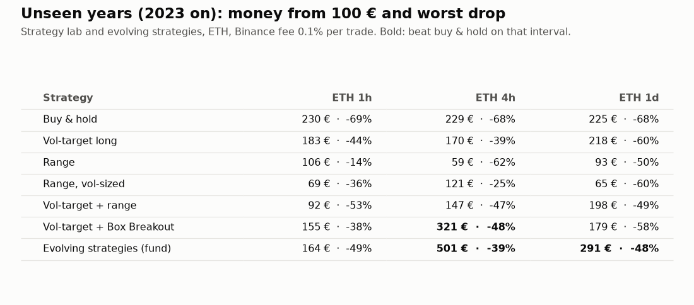

### Evolving strategies

`ml/strategy_evolution.py` makes those pieces genes and lets selection
pick them on every interval, from the past only: `core`/`target`/`band`
(the vol-target long), `box_w` (Box Breakout), `range_w`, `center`, `k`,
`exit`, `stop`, `trend_max`, `long_short` (range trading). A strategy holds
`core x vol_target + box_w x box + range_w x range`, capped at all of its
money. Every 30 days each strategy is scored on up to 4 years before (log
growth after fees minus its worst drop), the 6 weakest of 24 are replaced
by mutated children of strong ones, and the fund holds the average of the
best 4 for the next month, averaged again over 3 independent populations
(one alone varied from 185 € to 464 € on the same 4h TEST, by seed).

| Unseen years (2023 on) | Fund | Worst drop | Buy & hold | Worst drop |
|---|---|---|---|---|
| 4h | 501 € (+401%) | 39% | 230 € (+130%) | 68% |
| 1d | 291 € (+191%) | 48% | 225 € (+125%) | 68% |
| 1h | 164 € (+64%) | 49% | 230 € (+130%) | 69% |

| 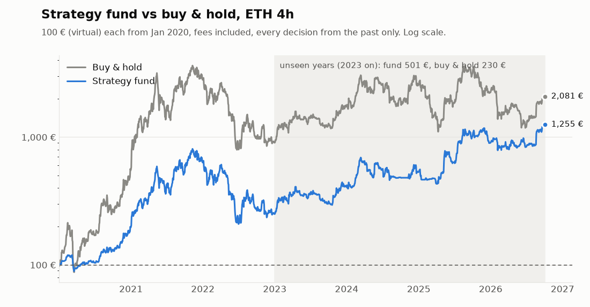 | 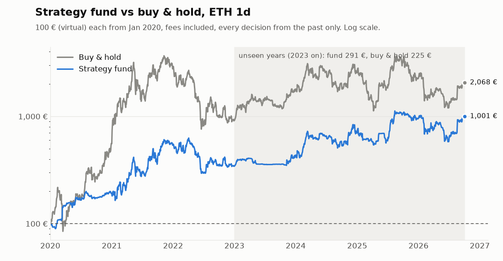 |
|---|---|
| 4h: 1,255 € since 2020 (buy & hold 2,081 €); 501 € on the unseen years (230 €). | 1d: 1,001 € since 2020 (buy & hold 2,068 €); 291 € on the unseen years (225 €). |

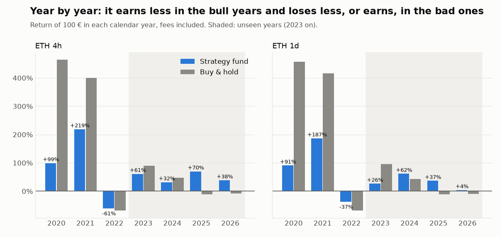

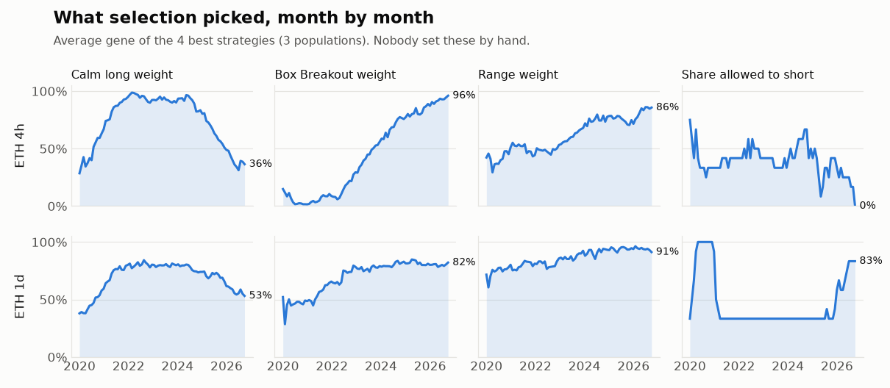

The lookback, penalty and seed averaging were chosen on 4h's TEST, so 4h
is somewhat optimistic; 1d and 1h, run with them unchanged, are the honest
check. Since 2020 the 4h fund made +1,155% to buy & hold's +1,981%, with
a 77% worst drop to 81%: it earns less in the big bull years (2020, 2021),
more in the bad ones (2025 +70% vs -11%), and still fell 61% in 2022. On
4h selection dropped shorts and moved from the calm long toward Box
Breakout and range; on 1d it dropped shorts from 2021 to 2025 and took
them back in 2026; on 1h it kept small positions and the fees ate it, so
the live fund runs on 4h and 1d only. 15m is still to be tested (`--interval 15m
--candles 150000`, ~35 min: the walk-forward Box Breakout grows with the
square of the history).

**Live.** `ml/strategy_fund.py` replays the whole history since August 2017
(so the same candles always give the same fund: ~1 min on 4h, ~10 s on 1d)
and saves a report to `data/strategy_fund/`. `run_api.py` runs it in its
own process at startup and a few minutes past every hour, only for an
interval a new candle has closed on; the API and pages just read the
report.

```bash
.venv/bin/python -m ml.strategy_fund                    # 4h and 1d, by hand
.venv/bin/python -m ml.strategy_evolution --interval 1d # the research run with year-by-year output
```

## Performance

Training one model (a full ensemble) takes ~6s — not acceptable on a
request. Mitigations in place:
- **Prediction cache** (`api/services.py`) with a 900s TTL, aligned with the
  actual data-collection cadence (15 min) — there's no point expiring it
  faster than the underlying data changes anyway.
- **Warm-up thread** (`run_api.py`) — proactively trains, in the background,
  at startup and every 5 min, every interval (15m/1h/4h/1d/1w) × both model
  variants, so real requests and the evaluation snapshots always find a warm
  cache.
- The lock around training covers the whole read-train-write cycle, not just
  the dict access — two concurrent requests for the same key (e.g. the chart
  + the daily summary on refresh) no longer train it twice.
- A dedicated cache (3s) for the Scout AI detail page — a second click on
  the same asset is instant instead of retraining.

Measured result: a full dashboard load dropped from 8-15s (cold) to ~1.8s.

## Tests

```bash
pytest tests/ -q
```

All tests run offline: the database is `mongomock`, HTTP calls to
Binance/CoinGecko/DeFiLlama are intercepted with `requests-mock` or stubbed
explicitly (see `tests/conftest.py`).

## Extending to other cryptocurrencies

Every function in `data_collector`, `ml`, and `api/services.py` takes
`coin_id` (CoinGecko id) and, where relevant, `symbol` (Binance symbol) as
optional parameters defaulting from `config.py`. For the main dashboard, it's
enough to call the endpoints with `?coin_id=bitcoin` (after also extending
`BINANCE_SYMBOL`/`COIN_ID` per coin). Scout AI already scans dozens of assets
at once, independent of whichever coin the dashboard is configured for.

## Adding visuals and analysis charts

Where to add your own images, diagrams and analysis:

| You want to... | Put it here |
|---|---|
| Add a screenshot or chart to this README | Save it in `docs/images/`, then ``. Reproducible charts go in `docs/scripts/` (see `band_charts.py`). |
| Add a diagram | Write a ` ```mermaid ` block right in the Markdown, like the ones above. GitHub renders it. No image file needed, and it stays editable. |
| Change what each prediction image shows | `evaluation/charts.py` → `draw_prediction()`. Every snapshot and final chart goes through it. |
| Add a new per-day image | `evaluation/daily_report.py` → `build_daily_report()`. It already writes the overview PNG, GIF and PDF. |
| Analyze the statistics in a spreadsheet | Open `data/charts/stats.csv` (one row per model × interval), or the `stats.json` of any folder. |
| Analyze every single prediction | `GET /api/evaluation/predictions.csv`, the CSV button on `/evaluation.html`, or the SQLite file `data/predictions.db` directly. |
| Add a stats panel or chart to the app | `frontend/web/visual.js` / `visual.html`: `GET /api/evaluation/stats` takes the same filters as the gallery. |
| Check a model change before shipping it | `ml/walk_forward.py`, as in [Walk-forward backtest](#walk-forward-backtest). |

A quick analysis from Python, for example direction accuracy per model and
interval:

```python
import pandas as pd, sqlite3
df = pd.read_sql("SELECT * FROM predictions WHERE status = 'completed'", sqlite3.connect("data/predictions.db"))
print(df.groupby(["model_name", "interval"]).agg(
    predictions=("id", "count"),
    mean_abs_error_pct=("pct_error", lambda s: s.abs().mean()),
    direction_accuracy=("direction_correct", "mean"),
))
```
